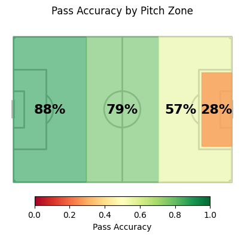

# Recommending Similar Football Players Using Technical Performance Indicators

# Project Poster

[View the project poster (PDF)](poster.pdf)

## Project Overview

This project introduces a **data-driven player similarity and recommendation system** for professional football scouting. It helps clubs identify **top-k replacement players** who match both the position and **playing style** of a missing player by transforming large-scale event data into **context-aware, explainable player representations**.

---

## Objective

The main objective is to develop a **scalable recommendation method** that:
- Aggregates detailed match events into meaningful player profiles  
- Captures **technical, spatial, and contextual performance characteristics**  
- Recommends similar players using vector similarity  
- Supports scouting decisions with transparent and reproducible analytics  

---

## Data

The project uses event-level football data provided by the **StatsBomb Python API**, covering the **2015/16 season** across:

- Premier League  
- Bundesliga  
- La Liga  
- Serie A  
- Ligue 1  
- UEFA Champions League  

The raw dataset consists of **over 6.3 million events** with **122 attributes per event**, including event type, outcome, and pitch location.

---

## Methodology

### Feature Engineering
- Event-level data aggregated into **player-level feature vectors**
- Contextual variables added (pitch zones, pressure situations, outcomes)
- Over **1,000 features** generated across:
  - Goalkeeping  
  - Defending  
  - Possession  
  - Passing  
  - Shooting  

### Exploratory Data Analysis
- Spatial heatmaps reveal distinct movement and involvement patterns by position
- Performance metrics (e.g. pass accuracy) vary significantly by pitch location
- Clear role-based action patterns emerge across positions

### Feature Selection
To reduce multicollinearity and prevent overfitting:
- Two feature selection strategies are evaluated:
  1. Logistic Regression with L1 regularization  
  2. Correlation prefiltering combined with domain knowledge  

### Modeling
- Multiple models evaluated using **5-fold cross-validation**
- **LightGBM** achieves the best performance:
  - ~90% overall accuracy  
  - Perfect classification for goalkeepers and defenders  
  - High stability across folds 

### Clustering
- SHAP-transformed features clustered using **K-Means**
- Dimensionality reduction with **UMAP** for visualization
- Results show:
  - Perfect separation between main positions  
  - Heterogeneous clusters within positions, indicating overlapping role profiles  

### Recommendation System
- Player vectors compared using **cosine similarity**
- Recommendation lists generated for *k = 10* and *k = 30*
- Relevance defined by matching position labels
- Relevant players consistently rank at the top

---

## Key Findings

- Contextual and spatially-aware features provide a **strong representation of player behaviour**
- Players with different official role labels may share **similar on-field performance patterns**
- Aggregated player vectors enable **fast, high-quality scouting shortlists**

